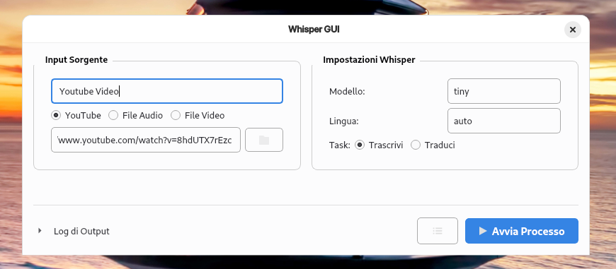
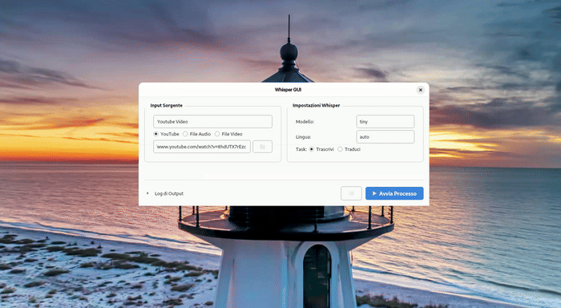
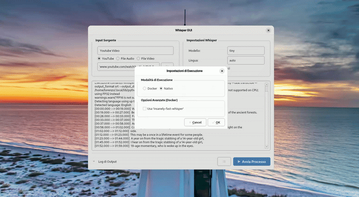
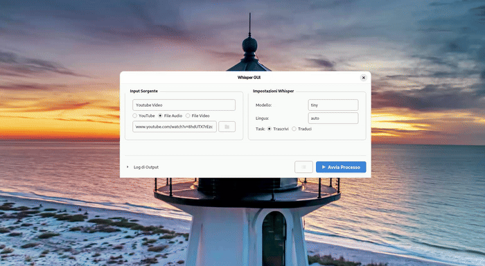

# Whisper GUI

<p align="center">
  <strong>A user-friendly graphical interface for OpenAI's Whisper, simplifying the transcription and translation of audio from files or YouTube links.</strong>
<!-- </p>
<p align="center">
  You can replace this with a real screenshot of your application 
  
</p> -->


<!-- GIF 1: Main workflow from local 'media' folder -->
<p align="center">
  
</p>

---

## ✨ Key Features

*   **Flexible Input**: Process local audio/video files or simply paste a YouTube link.
*   **Dual Execution Modes**: Choose between a native local execution (CPU/GPU) or an isolated Docker environment.
*   **Whisper Integration**: Leverages OpenAI's powerful models for accurate transcriptions and translations.
*   **Accelerated Transcription**: Option to use `insanely-fast-whisper` in Docker mode for significantly faster processing.
*   **Intuitive User Interface**: A clean and easy-to-use interface built with PyQt6.
*   **Customizable Output**: Get your transcriptions in SRT format.
*   **Subtitle Integration**: Embed the generated subtitles directly into the video as a soft track (`*_subs.mp4`) or burned into the image (`*_burned.mp4`).
*   **Configurability**: Adjust settings like the output directory and Docker details via a configuration file.

## 🚀 Getting Started

This guide will walk you through setting up and running the project on your local system.

### 📋 Prerequisites

Before you begin, ensure you have the following dependencies installed on your system.

*   **Python 3.11** or higher
*   **FFmpeg**: Required for audio processing.
    *   **For Windows**: Download it from the [official website](https://ffmpeg.org/download.html) and add it to your system's PATH.
    *   **For macOS (with Homebrew)**: `brew install ffmpeg`
    *   **For Debian/Ubuntu**: `sudo apt update && sudo apt install ffmpeg`
*   **Docker** (Optional, only required for Docker mode): [Install Docker](https://docs.docker.com/get-docker/).

### 🛠️ Installation

1.  **Clone the repository:**
    ```bash
    git clone https://github.com/your-username/your-project.git
    cd your-project
    ```

2.  **Choose your execution mode** and install the corresponding dependencies.

    *   **For Native (Local) Execution:**
        Create a virtual environment and install the required packages. Choose the `requirements.txt` file that matches your hardware.

        ```bash
        # Create a virtual environment
        python -m venv venv

        # Activate it
        # Windows
        venv\Scripts\activate
        # macOS/Linux
        source venv/bin/activate

        # Install dependencies based on your hardware
        # For NVIDIA GPU (CUDA)
        pip install -r requirements-cuda.txt

        # For AMD GPU (ROCM)
        pip install -r requirements-rocm.txt

        # For CPU only
        pip install -r requirements-cpu.txt
        ```

    *   **For Docker Execution:**
        You do not need to install Python packages locally. Just ensure the Docker daemon is running. The project is configured to use a specific Docker container named `rocm-terminal`. You can customize this in the configuration file.

## ⚙️ Configuration

The project uses a `config.json` file to manage settings. This file is automatically created in `~/.config/WhisperGUI/` on the first run.

<!-- GIF 3: Advanced settings from local 'media' folder -->


Here are the key configuration options:

*   `execution_mode`: Choose between `"native"` and `"docker"`.
*   `docker_container_name`: The name of your running Docker container (e.g., `"rocm-terminal"`).
*   `use_insanely_fast_whisper`: Set to `true` to use the accelerated version in Docker mode.
*   `input_dir` / `output_text_dir`: Define the default directories for input and output files.

<br clear="right"/>

## ▶️ Usage

You can run the project via the graphical user interface or the command line.

### 🖥️ Graphical User Interface (GUI)

This is the easiest way to use the tool.

1.  **Launch the application:**
    ```bash
    python gui.py
    ```
2.  **Choose your input source**:
    *   **YouTube**: Paste the link.
    *   **Audio/Video File**: Click the browse button to select a file.
    
    <!-- GIF 2: Input flexibility from local 'media' folder -->
    

3.  **Provide an output file name.** If left blank, a default name will be used.
4.  **Adjust Whisper settings**: Select the model, language, and task (transcribe or translate).
5.  **Open the settings (gear icon)** to choose the execution mode (Native or Docker).
6.  **Optional - Integrate subtitles into the video**: Use the "Sottotitoli nel video" dropdown to embed the generated SRT as a soft track (MP4/MKV, toggleable in the player) or burned into the image (MP4). This requires the SRT format and a video source (local video file or YouTube in "Audio + Video" mode).
7.  **Click "Start Process"** to begin! Progress will be displayed in the GUI.

### ⌨️ Command-Line Interface (CLI)

For automation or headless environments, two CLI scripts are available.

*   **Standard Whisper (via Docker):**
    ```bash
    python main_cli.py
    ```
    The script will prompt you to enter a YouTube link, a file name, and the model to use.

*   **Insanely-Fast-Whisper (via Docker):**
    ```bash
    python main_cli_fast.py
    ```
    Similar to the standard CLI, but it uses the optimized script for faster processing.

*   **CLI with subtitle integration:**
    ```bash
    python main.py --cli -f video.mp4 --subs soft   # traccia soft (MP4/MKV)
    python main.py --cli -f video.mp4 --subs burn   # sottotitoli incisi (MP4)
    ```

## 📂 Project Structure

```
.
├── media/               # Contains GIFs and other media for the README
├── core/                # Core logic (Docker, Native, YouTube managers)
├── services/            # Processing service that connects the logic
├── ui/                  # PyQt6 UI components (main window, dialogs)
├── utils/               # Helper modules (config, audio tools)
├── gui.py               # Entry point for the GUI
└── README.md            # This file
```

## 💡 Future Developments

*   Improve error handling and logging.
*   Implement a progress bar for Docker mode.
*   Expand the supported output formats (e.g., TXT, VTT).